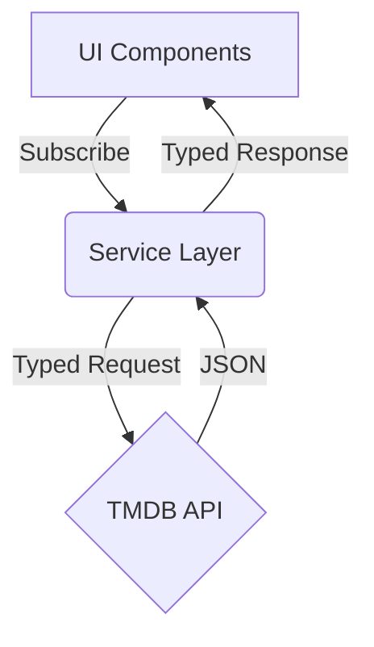

# StreamFlow
### High-Performance Content Discovery Engine


## 🚀 Overview

**StreamFlow** is a next-generation streaming interface designed to showcase **extreme performance**, **modern architecture**, and **premium UX patterns**. Unlike traditional "clones", StreamFlow focuses on engineering quality, using a centralized API layer, TypeScript for type safety, and optimized rendering strategies.

## 🛠 Tech Stack

-   **Core**: React 18, Vite, TypeScript
-   **Styling**: Tailwind CSS (Custom "Deep Ocean" Design System)
-   **Architecture**: Service-based API layer, Adapter Pattern
-   **State Management**: React Hooks (Custom `useApi` hooks)
-   **Performance**: Memoization (`React.memo`, `useMemo`), Virtualization-ready structure

## ✨ Key Features

### 1. Centralized Service Layer
Decoupled API logic from UI components.
*   **Source**: `src/services/api.ts`
*   **Benefit**: changing data sources requires zero UI changes. Fully typed responses ensure reliability.

### 2. "Smart Player" Simulation
A bespoke video player interface simulating network states.
*   **Features**: Adaptive buffering states, playback controls, and immersive overlays.
*   **UX**: Smooth transitions and backdrop blur effects using Tailwind's JIT engine.

### 3. Optimized Rendering
*   **Lazy Loading**: Images are loaded only when necessary.
*   **Refined Layouts**: CSS Grid/Flexbox combinations optimized for repaint performance.

## 🏗 Architecture



## 🚀 Getting Started

1.  **Install dependencies**
    ```bash
    npm install
    ```
2.  **Run Development Server**
    ```bash
    npm run dev
    ```

## 🎨 Design System

StreamFlow moves away from generic "Red/Black" themes to a sophisticated **"Cyberpunk Purple"** and **"Deep Ocean Blue"** palette, creating a distinct product identity.

---
*Engineered by [Your Name]*
